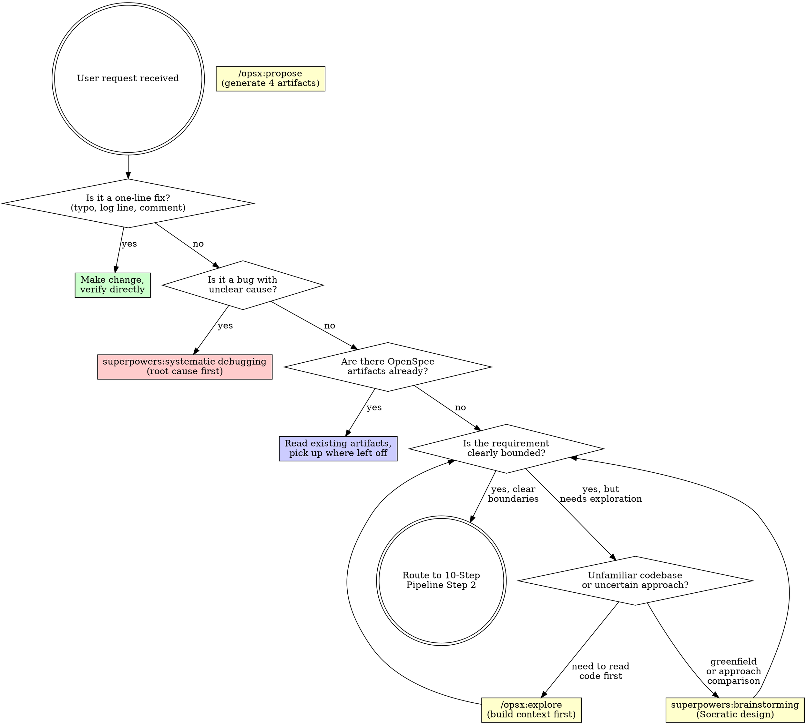

<SUBAGENT-STOP>
If you were dispatched as a subagent to execute a specific task, skip this skill.
</SUBAGENT-STOP>

<EXTREMELY-IMPORTANT>
Spec-driven development means specs live in the file system, not in chat history. OpenSpec manages specification artifacts. Superpowers enforces execution discipline. This skill routes between them.

IF A SPEC EXISTS, YOU MUST READ IT BEFORE WRITING CODE. IF NO SPEC EXISTS FOR BEHAVIOR CHANGE, YOU MUST CREATE ONE FIRST.

This is not negotiable. This is not optional. You cannot rationalize your way out of this.
</EXTREMELY-IMPORTANT>

## Instruction Priority

1. **User's explicit instructions** (CLAUDE.md, AGENTS.md, direct requests) — highest priority
2. **OpenSpec artifacts** (proposal.md, specs/, design.md, tasks.md) — the authoritative spec baseline
3. **SDD workflow skills** — route and enforce process
4. **Default system prompt** — lowest priority

If the user says "skip the spec, just write code," follow the user's instructions. The user is in control.

# SDD Workflow — Spec-Driven Development Router

## The Rule

**Before any code, human and AI agree on what to build.** Specifications are files in `openspec/`. Every behavior change is traceable from proposal through archive. Run `openspec init` if `openspec/` doesn't exist.

**Announce at start:** "I'm using the sdd-workflow skill to route this development task."

## The 10-Step Pipeline

OpenSpec provides the specification skeleton (What). Superpowers enforces execution discipline (How). They connect in sequence with no overlap:

```
0. [Optional] superpowers:brainstorming  — 探索性规划。输出: design doc → 作为 Step 2 的输入。
                                           ⛔ 完成后去 Step 2，禁止直接去 writing-plans。

1. [User request]
     ↓
2. /opsx:propose <name>            — OpenSpec: 创建提案。一步生成四大件。
     ↓                               proposal.md + specs/ + design.md + tasks.md
3. [Manual review + iterate]       — OpenSpec: 细化规范。逐项审核、修正四大件。
     ↓                               可选 /opsx:continue 逐步生成、/opsx:ff 快进。
4. /opsx:verify                    — OpenSpec: 验证规范。三维验证（完整/正确/一致）。
     ↓
5. superpowers:writing-plans       — Superpowers: 生成开发计划。
     ↓                               输出: openspec/changes/<name>/plan.md
6. /opsx:apply +                   — Superpowers: TDD开发。apply = 调度器，TDD = 执行器。
   @test-driven-development          RED → GREEN → REFACTOR 逐任务循环。
     ↓
7. @requesting-code-review         — Superpowers: 代码审查。
     ↓
8. @verification-before-           — Superpowers: 完成前验证。新鲜测试证据。
   completion
     ↓
9. /opsx:archive <name>            — OpenSpec: 归档变更。Delta 合并 + 移到 archive/。
     ↓
10. [Delivered]                    — 交付上线
```

## OpenSpec Command Reference

| 命令 | 说明 | 使用场景 |
|------|------|---------|
| `/opsx:propose` | 一步生成完整变更工件 | 需求清晰，直接开干 |
| `/opsx:explore` | 探索调研，不产生文件 | 需求模糊、技术选型、方案对比 |
| `/opsx:apply` | 按 tasks.md 逐条写代码 | 实现阶段 |
| `/opsx:archive` | 归档，合并规格 | 功能完成收尾 |
| `/opsx:new` | 只创建变更骨架 | 想手动控制节奏 |
| `/opsx:continue` | 生成下一个工件 | 逐步审查，每步确认 |
| `/opsx:ff` | 快进生成所有剩余工件 | 确认方向后加速 |
| `/opsx:verify` | 三维度验证实现 | 归档前质量检查 |
| `/opsx:sync` | 只同步规格不归档 | 并行变更需引用 |
| `/opsx:bulk-archive` | 批量归档 | 多功能统一收尾 |

## Request Classification

When the user brings a development request, classify FIRST. Then route.



## Phase Detection

Check the file system to determine where you are in the workflow:

| What exists | Phase | Next action |
|------------|-------|-------------|
| No `openspec/` directory | Uninitialized | Run `openspec init` first |
| `openspec/` exists, no change dir | Ready for proposal | Route to Step 2: `/opsx:propose <name>` or Step 0: exploration |
| `openspec/changes/<name>/` with 4 artifacts, unreviewed | Specs need review | Step 3-4: Manual review → `/opsx:verify` |
| `openspec/changes/<name>/` with reviewed artifacts | Ready for execution | Step 5: `superpowers:writing-plans` |
| `tasks.md` has unchecked items | In progress | Step 6: `/opsx:apply` + `@test-driven-development` |
| All tasks checked, not archived | Ready for delivery | Steps 7-8: review → verify → Step 9: `/opsx:archive` |

## Transition Rules

### Step 0 → Step 2: The Critical Handoff

Brainstorming (Step 0) is optional. When requirements are already clear, skip to Step 2.

**When brainstorming completes and the user approves the design:**

1. **DO NOT** invoke `writing-plans` — this bypasses OpenSpec
2. **DO NOT** write code — the spec isn't locked yet
3. **DO** invoke `/opsx:propose "<name>"` — feed the approved brainstorming design as context
4. **DO** verify `openspec/changes/<name>/` contains: proposal.md, specs/, design.md, tasks.md
5. Only then proceed to Step 3.

**Why:** Brainstorming produces an exploratory design (Phase 1 — Superpowers). OpenSpec locks it into auditable, mergeable artifacts (Phase 2 — OpenSpec). `docs/superpowers/specs/` is transient; `openspec/changes/<name>/` is permanent and traceable. Skipping Step 2 means specs can't be verified, archived, or traced.

### Step 2-10: Linear Execution

```
Step 2: /opsx:propose <name>     → 已做 Step 0 则传入其输出。确认产物后进入 Step 3。

Step 3: Manual review + iterate   → 逐项审核提案/规格/设计/任务。
                                     可选: /opsx:continue 逐步 | /opsx:ff 快进。
                                     标准: 每个 in-scope 项有对应任务 checkbox。

Step 4: /opsx:verify              → 三维验证（完整/正确/一致）。通过后进入执行阶段。

Step 5: superpowers:writing-plans → MUST save to openspec/changes/<name>/plan.md
                                     (禁止写入 docs/superpowers/plans/)。
                                     产出 2-5 分钟粒度的子任务。

Step 6: /opsx:apply +             → apply = 调度器, TDD = 执行器。
  @test-driven-development          RED → GREEN → REFACTOR 每任务循环。
                                     出错: @systematic-debugging → 返回 apply。
                                     全部完成 → Step 7。

Step 7: @requesting-code-review   → 派遣 code-reviewer。修复 Critical/Important 问题。

Step 8: @verification-before-     → 新鲜 go test ./... / pytest / etc。
  completion                        声称完成前必须有新的验证证据。

Step 9: /opsx:archive <name>      → Delta 合并到 openspec/specs/。
                                     Change 移到 openspec/changes/archive/。
                                     更新 project.md。

Step 10: Done                     → 交付上线。
```

## Tool Selection Matrix

When both OpenSpec and Superpowers offer a tool for the same phase:

| Scenario | Use This | Not That | Why |
|----------|----------|----------|-----|
| Reading existing code | `/opsx:explore` | `@brainstorming` | Explore reads code; brainstorming generates ideas |
| Defining new feature | `@brainstorming` | `/opsx:explore` | Brainstorming compares approaches |
| Generating spec artifacts | `/opsx:propose` | `@writing-plans` | Propose creates 4 artifacts; writing-plans refines |
| Refining task granularity | `@writing-plans` | Manual only | Writing-plans converts to 2-5min units |
| Executing tasks | `/opsx:apply` + `@test-driven-development` | Either alone | Apply schedules; TDD executes |
| Debugging failures | `@systematic-debugging` | Direct fixes | Root cause investigation first |
| Code review | `@requesting-code-review` + `@receiving-code-review` | "Looks good to me" | Structured independent review |
| Claiming completion | `@verification-before-completion` | "Should work now" | Fresh evidence required |
| Archiving work | `/opsx:archive` | Manual file moves | Archive does delta merge + timestamp |

## Red Flags

These thoughts mean STOP — you're rationalizing skipping the SDD process:

| Thought | Reality |
|---------|---------|
| "This is simple, I don't need a spec" | Simple changes cause complex bugs. A 5-line proposal.md saves hours. |
| "I'll write the spec after the code" | Specs-after describe what you built, not what's needed. |
| "The spec is in the conversation history" | Conversation history evaporates. Files persist. Write it down. |
| "I already know what to build" | Knowing ≠ having it reviewed. Specs are the agreement. |
| "Specs slow me down" | Rework from misaligned expectations is slower. |
| "This is just a prototype" | Prototypes become production. Spec now saves pain later. |
| "I'll just explore the codebase first" | Use `/opsx:explore` — structured, not aimless browsing. |
| "I remember how this codebase works" | Code evolves. Your memory is stale. Read the specs. |
| "Brainstorming done → writing-plans" | ⛔ WRONG. Brainstorming → `/opsx:propose` → review → THEN writing-plans. |
| "I'll write the design doc — that's the spec" | `docs/superpowers/specs/` is transient. `/opsx:propose` creates permanent `openspec/changes/<name>/` artifacts. |

**All of these mean: follow the SDD process. No shortcuts.**

## Skill Priority

When multiple tools could apply to a development task:

1. **Classification first** — Use the decision tree. One-line fix? Bug? Behavior change?
2. **Exploration before specification** — `/opsx:explore` to read code. `/opsx:propose` to generate artifacts. Never invert.
3. **Review before execution** — Step 3-4 gate. Specs must be reviewed before any code.
4. **Plan before implementing** — Step 5: `writing-plans` refines tasks.md. Save to `openspec/changes/<name>/plan.md`.
5. **TDD during execution** — Step 6: `/opsx:apply` + `@test-driven-development`. RED → GREEN → REFACTOR.
6. **Verify before claiming** — Step 8: `@verification-before-completion` with fresh evidence. Then Step 9: `/opsx:archive`.

## Skill Types

**Rigid** — Follow exactly. Don't adapt away the sequence:
- `/opsx:propose`, `/opsx:apply`, `/opsx:archive` — CLI tools with defined behavior
- `@test-driven-development` — RED → GREEN → REFACTOR, no shortcuts
- `@systematic-debugging` — Root cause before fixes
- `@verification-before-completion` — Fresh evidence required
- **`sdd-workflow`** (this skill) — Follow the routing exactly

**Flexible** — Adapt principles to context:
- `@brainstorming` — Socratic design, adapt depth to complexity
- `@writing-plans` — Task granularity scales with feature complexity
- `/opsx:explore` — Depth of exploration matches uncertainty level

## Related Skills

- **sdd-review-specs** — Structured review of OpenSpec 4 artifacts before implementation
- **superpowers:brainstorming** — Socratic design for greenfield features
- **superpowers:writing-plans** — Convert coarse tasks to 2-5min bite-sized units
- **superpowers:test-driven-development** — RED-GREEN-REFACTOR cycle
- **superpowers:systematic-debugging** — Root cause investigation before fixes
- **superpowers:verification-before-completion** — Evidence before completion claims
- **superpowers:requesting-code-review** — Structured code review
- **superpowers:finishing-a-development-branch** — Merge/PR/keep/discard decisions

## User Instructions

Instructions say WHAT, not HOW. "Add X" or "Fix Y" doesn't mean skip workflows. The SDD process is the HOW — it exists to ensure alignment before code, not to slow you down.

If you want to bypass a step (skip review, write code directly, skip the spec), say so explicitly. The user is in control. The skill routes, the user decides.
