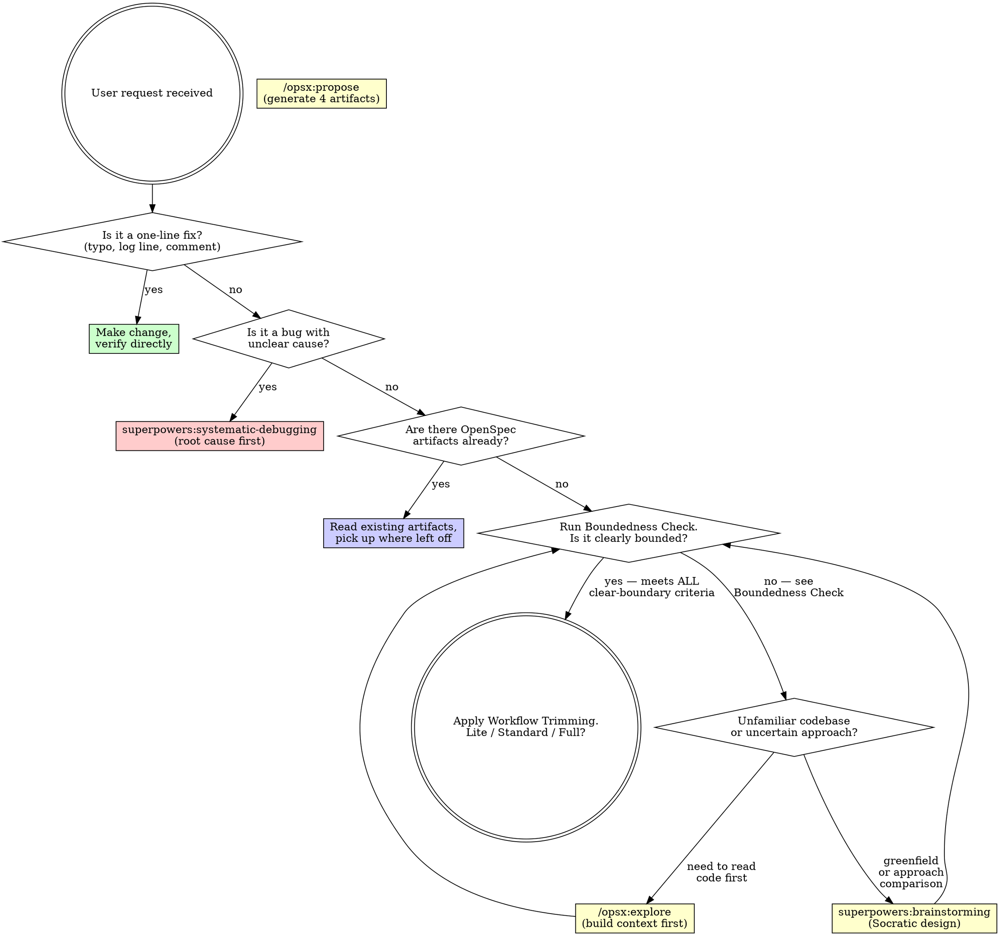

<SUBAGENT-STOP>
If you were dispatched as a subagent to execute a specific task, skip this skill.
</SUBAGENT-STOP>

<CRITICAL-OVERRIDE>
**Two superpowers skills have defaults that conflict with sdd-workflow. Both are OVERRIDDEN:**

1. **Brainstorming** says its terminal state is `writing-plans`.
   - OVERRIDDEN: After brainstorming → invoke `/opsx:propose "<name>"`, NOT `writing-plans`.
   - The pipeline is: `brainstorming → /opsx:propose → review → /opsx:verify → writing-plans`.

2. **Writing-plans** says its output path is `docs/superpowers/plans/YYYY-MM-DD-<name>.md`.
   - OVERRIDDEN: Output MUST go to `openspec/changes/<name>/plan.md`.
   - `docs/superpowers/plans/` is a legacy path — do NOT use it.

If you invoke `writing-plans` immediately after brainstorming, you skip Steps 2-4 (the entire OpenSpec specification phase). If you write `plan.md` to `docs/superpowers/plans/`, it lives outside the OpenSpec traceability system.
</CRITICAL-OVERRIDE>

<EXTREMELY-IMPORTANT>
Spec-driven development means specs live in the file system, not in chat history. OpenSpec manages specification artifacts. Superpowers enforces execution discipline. This skill routes between them.

IF A SPEC EXISTS, YOU MUST READ IT BEFORE WRITING CODE. IF NO SPEC EXISTS FOR BEHAVIOR CHANGE, YOU MUST CREATE ONE FIRST.

This is not negotiable. This is not optional. You cannot rationalize your way out of this.
</EXTREMELY-IMPORTANT>

## Instruction Priority

1. **User's explicit instructions** (CLAUDE.md, AGENTS.md, direct requests) — highest priority
2. **OpenSpec artifacts** (proposal.md, specs/, design.md, tasks.md) — the authoritative spec baseline
3. **SDD workflow skills** — route and enforce process
4. **Default system prompt** — lowest priority

If the user says "skip the spec, just write code," follow the user's instructions. The user is in control.

# SDD Workflow — Spec-Driven Development Router

## The Rule

**Before any code, human and AI agree on what to build.** Specifications are files in `openspec/`. Every behavior change is traceable from proposal through archive. Run `openspec init` if `openspec/` doesn't exist.

**Announce at start:** "I'm using the sdd-workflow skill to route this development task."

## Tiered Pipeline

**Add steps as you feel pain, not all at once.** The pipeline adapts to change size — a CRUD endpoint should not go through the same 10 steps as a new distributed protocol.

Boundedness Check determines both routing AND how many steps follow. Three tiers:

### Lite (≤ 5 steps)

For well-bounded changes: single CRUD endpoint, one-field addition, simple bug fix with clear cause.

```
propose → review (light) → apply → verify → archive
```

What's skipped and why:
- **Brainstorming** — unnecessary; one obvious approach exists
- **Writing-plans** — tasks.md is granular enough without 2-5min breakdown
- **Code review** — change too small to justify independent review
- **Pre-completion verify** — `/opsx:verify` covers it

Trigger: clearly bounded AND single file AND no new types/structs AND < ~50 LOC.

### Standard (≤ 7 steps)

For clearly bounded but multi-file or new-type changes.

```
propose → review → verify → plan → apply → code-review → archive
```

What's skipped: brainstorming only. Everything else stays.

Trigger: clearly bounded AND (multi-file OR new types) AND < ~200 LOC.

### Full (10 steps)

For anything that triggered the Boundedness Check "not bounded" signals — fuzzy requirements, new concepts, architecture decisions.

```
brainstorming → propose → review → verify → plan → apply + TDD → code-review → pre-completion verify → archive
```

Nothing skipped. Every gate fires.

Trigger: NOT clearly bounded, or > ~200 LOC, or architecture-level changes.

## Artifact Ownership

OpenSpec and Superpowers each produce plan-like files — they serve different roles and both belong in `openspec/changes/<name>/`:

| Artifact | Owner | Granularity | Purpose | Example |
|----------|-------|-------------|---------|---------|
| `tasks.md` | OpenSpec (`/opsx:propose`) | Coarse checkbox items | WHAT to implement | `- [ ] Implement Store interface` |
| `plan.md` | Superpowers (`writing-plans`) | 2-5min subtasks | HOW to implement | `1. Define Store interface in store/store.go (2 min)` |

**Rule:** `plan.md` refines `tasks.md` — it does NOT replace it. Both coexist in the same change directory. `writing-plans` reads `tasks.md` as input and outputs `plan.md` with detailed steps, file paths, and test names.

```
openspec/changes/<name>/
├── proposal.md    ← OpenSpec: why + scope boundary
├── specs/         ← OpenSpec: behavior delta specs
├── design.md      ← OpenSpec: technical decisions
├── tasks.md       ← OpenSpec: coarse implementation checklist (WHAT)
└── plan.md        ← Superpowers: refined subtasks (HOW)
```

`docs/superpowers/specs/` and `docs/superpowers/plans/` are legacy brainstorming output paths — they are NOT used by this workflow. All artifacts live under `openspec/changes/<name>/`.

## OpenSpec Commands Used

These 5 commands drive the SDD pipeline. The other opsx commands (`new`, `continue`, `ff`, `sync`, `bulk-archive`, `onboard`) are available but outside this skill's scope.

| Command | Used in Tier | Purpose |
|---------|-------------|---------|
| `/opsx:propose` | Lite, Standard, Full | Generate 4 artifacts in one step |
| `/opsx:explore` | Fuzzy → Full | Read code, build context before brainstorming |
| `/opsx:apply` | Lite, Standard, Full | Implement tasks from tasks.md |
| `/opsx:verify` | Standard, Full | 3-dimension validation before archive |
| `/opsx:archive` | Lite, Standard, Full | Delta merge + move to archive/ |

## Request Classification

When the user brings a development request, classify FIRST. Then route.

### Boundedness Check — BEFORE routing to Step 2

A task is **NOT "clearly bounded"** (and therefore MUST route through Step 0: exploration or brainstorming) if ANY of these are true:

| Signal | Example | Route to |
|--------|---------|----------|
| Introduces concepts NOT in the current data model | "add users", "add sharing", "add permissions" — and the codebase has no User/Share/Permission struct | `superpowers:brainstorming` |
| Has multiple valid interpretations with different architectures | "add collaboration" could mean real-time sync, async assignment, or shared views | `superpowers:brainstorming` |
| Uses hedging or vague language | "somehow", "或者", "something like", "加点协作能力" | `superpowers:brainstorming` |
| Requires comparing 2+ approaches with significant trade-offs | "should we use WebSocket or polling?" | `superpowers:brainstorming` |
| You don't know which files would change without reading code first | Unfamiliar codebase or new feature area | `/opsx:explore` → then re-run Boundedness Check → if still fuzzy → `superpowers:brainstorming` |

A task IS "clearly bounded" (can skip to Step 2) ONLY when ALL of these are true:
- The data model is already defined (structs/tables exist)
- There is exactly one obvious implementation approach
- The request uses specific, concrete language ("add a DELETE endpoint", "add a `due_date` field to Task")
- You can list the files that will change without reading any code

**Signal priority:** Brainstorming signals beat exploration signals. When a task matches BOTH a brainstorming signal AND the exploration signal, the flow is: `/opsx:explore` (read code, build context) → re-run Boundedness Check → `superpowers:brainstorming` (generate and compare approaches). Never skip the brainstorming step when ANY brainstorming signal is triggered.

**Default rule: if you're not sure, it's not clearly bounded. Route to exploration or brainstorming.**

### Workflow Trimming

The Boundedness Check result selects the pipeline tier. Size estimate after exploration determines which steps to skip:

| Change Profile | Tier | Steps Skipped |
|---|---|---|
| Single file, no new types, < 50 LOC | **Lite** | 0 (brainstorming), 5 (writing-plans), 7 (code-review), 8 (pre-completion verify) |
| Multi-file or new types, < 200 LOC | **Standard** | 0 (brainstorming) |
| New concepts, architecture changes, > 200 LOC, or fuzzy after explore | **Full** | None — every gate fires |

**Heuristic:** if `tasks.md` would have ≤ 3 checkboxes, you don't need `writing-plans`. If `/opsx:verify` runs the same tests as pre-completion verify would, skip the duplicate.

### CRITICAL: After `/opsx:explore` — Do NOT present options

`/opsx:explore` builds context. It does NOT authorize you to decide what to implement. After it completes:

- **Do NOT** present a numbered list of features and ask the user to pick
- **Do NOT** ask "你希望补充哪些功能？" or "Which features do you want?"
- **Do NOT** merge exploration + decision into one step

**You MUST instead:**
1. Re-run the Boundedness Check against the task
2. If ANY "not bounded" signal still applies → invoke `superpowers:brainstorming` to generate and compare approaches
3. Only skip brainstorming if the exploration revealed exactly ONE obvious gap (e.g., "this CRUD API is missing a DELETE handler")

**Wrong:** Explore → "Here are 4 options, pick one" → implement
**Right:** Explore → Boundedness Check → Brainstorming → `/opsx:propose` → review → implement



## Phase Detection

Check the file system to determine where you are in the workflow:

| What exists | Phase | Next action |
|------------|-------|-------------|
| No `openspec/` directory | Uninitialized | Run `openspec init` first |
| `openspec/` exists, no change dir | Ready for proposal | Classify → trim → propose or explore |
| `openspec/changes/<name>/` with unreviewed artifacts | Specs need review | Review (Lite/Full per tier) |
| `tasks.md` has unchecked items | In progress | `/opsx:apply` (with or without TDD per tier) |
| All tasks checked, not archived | Ready for delivery | Verify → archive |

## Transition Rules

### Step 0: Explore → Brainstorming Gate

When the Boundedness Check routes to `/opsx:explore` (because you don't know which files would change), `/opsx:explore` is read-only reconnaissance — it builds context, NOT decisions. After it completes:

1. **Re-run the Boundedness Check.** The task is still "not clearly bounded" unless the codebase exploration revealed a single obvious gap.
2. **If ANY "not bounded" signal still applies** → route to `superpowers:brainstorming`. Do NOT present options to the user. Do NOT ask the user what to implement. Brainstorming is where options are generated and compared.
3. **If the task is now clearly bounded** (rare after a fuzzy request) → proceed to Step 2: `/opsx:propose`.

**Why:** `/opsx:explore` answers "what exists." `superpowers:brainstorming` answers "what should we build." Mixing them (explore → offer choices → implement) skips design entirely. The DOT graph shows the loop: `explore → Boundedness Check` — this must execute, not be skipped.

### Step 0 → Step 2: The Critical Handoff

Brainstorming (Step 0) is optional. When requirements are already clear, skip to Step 2.

**The brainstorming skill says its terminal state is `writing-plans`. THIS IS OVERRIDDEN.** When brainstorming is invoked through sdd-workflow, the pipeline is: brainstorming → /opsx:propose → review → /opsx:verify → writing-plans.

When brainstorming completes and the user approves the design:

1. **DO NOT** invoke `writing-plans` — this bypasses OpenSpec Steps 2-4
2. **DO NOT** write code — the spec isn't locked yet
3. **DO** invoke `/opsx:propose "<name>"` — feed the approved brainstorming design as context
4. **DO** verify `openspec/changes/<name>/` contains: proposal.md, specs/, design.md, tasks.md
5. Only then proceed to Step 3.

**Why:** Brainstorming produces an exploratory design (Phase 1 — Superpowers). OpenSpec locks it into auditable, mergeable artifacts (Phase 2 — OpenSpec). `docs/superpowers/specs/` is transient; `openspec/changes/<name>/` is permanent and traceable. Skipping Step 2 means specs can't be verified, archived, or traced.

### Tier-Based Execution

```
Lite (≤ 5 steps):
  /opsx:propose → review (light) → /opsx:apply → /opsx:verify → /opsx:archive

Standard (≤ 7 steps):
  /opsx:propose → review → /opsx:verify → writing-plans → /opsx:apply + TDD → code-review → /opsx:archive

Full (10 steps):
  brainstorming → /opsx:propose → review → /opsx:verify → writing-plans → /opsx:apply + TDD → code-review → pre-completion verify → /opsx:archive
```

## Tool Selection Matrix

When both OpenSpec and Superpowers offer a tool for the same phase:

| Scenario | Use This | Not That | Why |
|----------|----------|----------|-----|
| Reading existing code | `/opsx:explore` | `@brainstorming` | Explore reads code; brainstorming generates ideas |
| Defining new feature | `@brainstorming` | `/opsx:explore` | Brainstorming compares approaches |
| Generating spec artifacts | `/opsx:propose` | `@writing-plans` | Propose creates 4 artifacts; writing-plans refines |
| Refining task granularity | `@writing-plans` | Manual only | Writing-plans converts to 2-5min units |
| Executing tasks | `/opsx:apply` + `@test-driven-development` | Either alone | Apply schedules; TDD executes |
| Debugging failures | `@systematic-debugging` | Direct fixes | Root cause investigation first |
| Code review | `@requesting-code-review` + `@receiving-code-review` | "Looks good to me" | Structured independent review |
| Claiming completion | `@verification-before-completion` | "Should work now" | Fresh evidence required |
| Archiving work | `/opsx:archive` | Manual file moves | Archive does delta merge + timestamp |

## Red Flags

These thoughts mean STOP — you're rationalizing skipping the SDD process:

| Thought | Reality |
|---------|---------|
| "This is simple, I don't need a spec" | Simple changes cause complex bugs. A 5-line proposal.md saves hours. |
| "I'll write the spec after the code" | Specs-after describe what you built, not what's needed. |
| "The spec is in the conversation history" | Conversation history evaporates. Files persist. Write it down. |
| "I already know what to build" | Knowing ≠ having it reviewed. Specs are the agreement. |
| "Specs slow me down" | Rework from misaligned expectations is slower. |
| "This is just a prototype" | Prototypes become production. Spec now saves pain later. |
| "I'll just explore the codebase first" | Use `/opsx:explore` — structured, not aimless browsing. |
| "I remember how this codebase works" | Code evolves. Your memory is stale. Read the specs. |
| "This task is clearly bounded, skip brainstorming" | ⛔ STOP. Run the Boundedness Check. Does the task introduce concepts NOT in the current data model? Does it have multiple valid interpretations? If yes → brainstorming. "Add collaboration" on a single-user app is NOT clearly bounded. |
| "I already explored the codebase, I can just list options" | ⛔ STOP. `/opsx:explore` answers "what exists," not "what to build." After explore, re-run Boundedness Check. If the task is still fuzzy → `superpowers:brainstorming`. Presenting a menu of options is NOT a substitute for Socratic design. |
| "The user said '完善' or 'improve' — that's clear enough" | Vague verbs imply the user trusts you to figure out WHAT to improve. That's exactly what brainstorming is for. Explore the codebase → brainstorm what should change → THEN propose. |
| "Brainstorming says go to writing-plans" | ⛔ OVERRIDDEN. sdd-workflow pipeline: brainstorming → `/opsx:propose` → review → verify → THEN writing-plans. |
| "I'll write the design doc — that's the spec" | `docs/superpowers/specs/` is transient. `/opsx:propose` creates permanent `openspec/changes/<name>/` artifacts. |
| "The brainstorming design IS the OpenSpec design" | No. Brainstorming output is INPUT to `/opsx:propose`. It must be translated into the 4 OpenSpec artifacts. |
| "This needs the full pipeline to be safe" | ⛔ STOP. Over-processing wastes time. A single-file CRUD endpoint is Lite, not Full. Use the Workflow Trimming table. Add steps only when you feel pain. |

**All of these mean: follow the SDD process. No shortcuts. But no detours either — match process to risk.**

## Skill Priority

1. **Classification first** — Boundedness Check + Workflow Trimming. Assign Lite / Standard / Full.
2. **Adapt depth to tier** — Lite skips 4 steps; Standard skips 1; Full skips none. Don't over-process small changes.
3. **Explore before design** — If you don't know the codebase, read it before proposing. If still fuzzy, brainstorm.
4. **Spec before code** — Always `/opsx:propose` before implementation. No code without a spec.
5. **Add steps as you feel pain** — Don't add writing-plans until tasks.md feels too coarse. Don't add pre-completion verify until verify alone proves insufficient.

## Skill Types

**Rigid** — Follow exactly. Don't adapt away the sequence:
- `/opsx:propose`, `/opsx:apply`, `/opsx:archive` — CLI tools with defined behavior
- `@test-driven-development` — RED → GREEN → REFACTOR, no shortcuts
- `@systematic-debugging` — Root cause before fixes
- `@verification-before-completion` — Fresh evidence required
- **`sdd-workflow`** (this skill) — Follow the routing exactly

**Flexible** — Adapt principles to context:
- `@brainstorming` — Socratic design, adapt depth to complexity (but terminal routing is OVERRIDDEN by sdd-workflow)
- `@writing-plans` — Task granularity scales with feature complexity
- `/opsx:explore` — Depth of exploration matches uncertainty level

## Related Skills

- **sdd-review-specs** (included: `reference/sdd-review-specs.md`) — Structured review of OpenSpec 4 artifacts before implementation
- **superpowers:brainstorming** — Socratic design for greenfield features
- **superpowers:writing-plans** — Convert coarse tasks to 2-5min bite-sized units
- **superpowers:test-driven-development** — RED-GREEN-REFACTOR cycle
- **superpowers:systematic-debugging** — Root cause investigation before fixes
- **superpowers:verification-before-completion** — Evidence before completion claims
- **superpowers:requesting-code-review** — Structured code review
- **superpowers:finishing-a-development-branch** — Merge/PR/keep/discard decisions

## User Instructions

Instructions say WHAT, not HOW. "Add X" or "Fix Y" doesn't mean skip workflows. The SDD process is the HOW — it exists to ensure alignment before code, not to slow you down.

If you want to bypass a step (skip review, write code directly, skip the spec), say so explicitly. The user is in control. The skill routes, the user decides.
